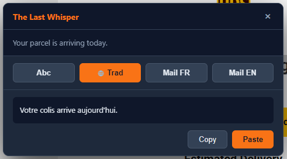

# The Last Whisper

A cross-platform desktop dictaphone with local speech-to-text and AI-powered text processing. Hold a key, speak, release — your words appear wherever your cursor is.

No cloud STT, no latency, no subscription. The transcription happens entirely on your machine.


## How it works

### Push-to-talk dictation
1. **Hold** `Ctrl+Space` — recording starts, a bubble with an oscilloscope appears
2. **Speak** — optionally click an action button (Abc, Trad, Mail FR, Mail EN)
3. **Release** — transcription runs locally (~50-100ms), text is pasted automatically

### AI assistant (double Ctrl+C)
1. **Select text** anywhere, press `Ctrl+C` twice quickly
2. An overlay appears with 4 actions:
   - **Abc** — fix spelling & grammar
   - **Trad** — smart translate (auto-detects language direction)
   - **Mail FR** — rewrite as professional French email
   - **Mail EN** — rewrite as professional English email
3. Click **Copy** or **Paste** to insert the result



### Smart translate (DeepL-like)

Set your **native language** and **target language** in the tray menu. The Trad button automatically translates in the right direction:

- Dictation (bubble): always translates to your target language
- Selection (overlay): detects the language — if it's your native, translates to target; otherwise translates to native

Supports: French, English, German, Spanish, Italian, Portuguese, Dutch.

## Features

- **Local STT** via [sherpa-onnx](https://github.com/k2-fsa/sherpa-onnx) — no internet needed for transcription
- **Dual engine** — Parakeet TDT v3 for short segments (~50ms), auto-switches to Whisper Turbo for longer recordings (configurable threshold)
- **Smart translate** — configurable language pair, auto-detects direction like DeepL
- **AI text processing** via Gemini 2.5 Flash Lite — correction, translation, email formatting
- **Auto-paste** — text goes straight into the focused app (VBScript on Windows, xdotool/ydotool on Linux)
- **Push-to-talk** — true hold/release via uiohook-napi, no key repeat issues
- **Multi-monitor** — all windows open on the screen where your cursor is
- **System tray** — full settings: microphone, STT models, language pair, Whisper threshold, API key
- **Encrypted config** — Gemini API key stored via Electron safeStorage (DPAPI on Windows, libsecret on Linux)
- **Model manager** — download/delete STT models from the app


## STT Models

| Model | Best for | Speed | Size |
|-------|----------|-------|------|
| Parakeet TDT v3 (int8) | Short segments, fast response | ~50-100ms | 464 MB |
| Whisper Turbo (int8) | Long recordings, high accuracy | ~2-3s | 538 MB |

The dual engine automatically picks the right model based on recording duration. Threshold is configurable from the tray menu (default: 10s).

## Installation

### Prerequisites
- [Node.js](https://nodejs.org/) 18+
- A Gemini API key (free at [aistudio.google.com](https://aistudio.google.com/))

### Setup

```bash
git clone https://github.com/david-digitis/the-last-whisper.git
cd the-last-whisper
npm install
```

### Run

**Important:** Do not launch from the VS Code integrated terminal (it sets `ELECTRON_RUN_AS_NODE` which breaks Electron).

```bash
# Windows (PowerShell or Windows Terminal)
npx electron .

# Linux
npx electron .
```

On first launch, an onboarding wizard will guide you through setting up your Gemini API key and microphone. STT models can be downloaded from the tray menu > STT Models.

### Build

```bash
# Windows (.exe portable)
npm run build:win

# Linux (.AppImage)
npm run build:linux
```

## Linux notes

See [LINUX-INSTRUCTIONS.md](LINUX-INSTRUCTIONS.md) for detailed Linux/Wayland setup instructions.

Key dependencies on Fedora:
```bash
sudo dnf install libX11-devel libXtst-devel libXinerama-devel ydotool gnome-shell-extension-appindicator
```

## Tech stack

- **Electron 33** — main + renderer processes
- **sherpa-onnx-node** — local STT (Parakeet TDT v3 + Whisper Turbo)
- **Gemini 2.5 Flash Lite** — AI text processing (REST API)
- **uiohook-napi** — global hotkeys (push-to-talk + double Ctrl+C detection)
- **Web Audio API** — microphone capture via hidden BrowserWindow

Only 2 runtime dependencies: `sherpa-onnx-node` and `uiohook-napi`.

## Architecture

```
THE-LAST-WHISPER/
├── main.js              # Main process — orchestration, hotkeys, windows
├── preload.js           # Secure IPC bridge (contextBridge)
├── preload-audio.js     # IPC bridge for audio worker
├── src/
│   ├── stt.js           # STT engine (dual model, auto-switch)
│   ├── recorder.js      # Audio capture (hidden window + MediaDevices)
│   ├── gemini.js        # Gemini client (bubble + overlay actions)
│   ├── config.js        # Config store (safeStorage for secrets)
│   ├── tray.js          # System tray (3 states, menus, API key dialog)
│   ├── paste.js         # Clipboard + auto-paste (VBScript/xdotool)
│   ├── models.js        # Download/manage STT models
│   ├── sounds.js        # Audio feedback (beeps)
│   ├── logger.js        # File logger (debug.log)
│   └── platform.js      # OS abstractions
└── ui/
    ├── audio-worker.html # Hidden window for mic capture
    ├── bubble/           # Recording bubble + action buttons
    ├── overlay/          # AI overlay (double Ctrl+C)
    ├── models/           # Model manager
    └── onboarding/       # First launch wizard
```

## License

MIT — see [LICENSE](LICENSE).

## Author

David Bertrand — [Digitis](https://digitis.cloud)
