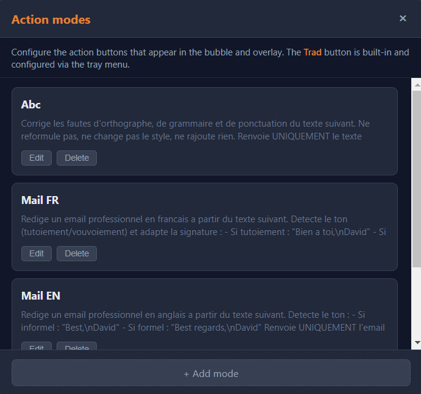
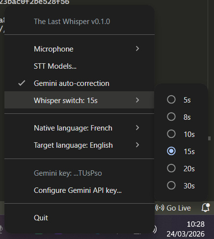

# The Last Whisper

**Speak. Translate. Rewrite. Instantly, from any app.**

A push-to-talk dictaphone that transcribes your voice in ~50ms — locally, without sending a single byte of audio to the cloud. Need more? One click translates, corrects, or rewrites your text as a professional email via Gemini AI.


---

## Three tools in one shortcut

### Dictation — just talk, it types

Hold `Ctrl+Space`, speak, release. Your words appear wherever your cursor is — any text field, any app. Transcription runs entirely on your machine using [sherpa-onnx](https://github.com/k2-fsa/sherpa-onnx), with no internet needed.

**~50ms latency.** That's faster than your fingers leaving the keyboard.

### Translation — like DeepL, but built-in

Click the **Trad** button while dictating, or select existing text and double `Ctrl+C`. The Last Whisper detects the language and translates to/from your native language automatically.

You speak French and dictate in French? It translates to English.
You select English text? It translates to French.
No copy-paste into a separate app. No switching windows.


### Rewriting — correction, emails, custom prompts

During recording, action buttons slide in. Click one before you release to process your text:

| Button | What it does |
|--------|-------------|
| *(none)* | Raw transcription — pasted as-is |
| **Abc** | Fix grammar, spelling & punctuation |
| **Trad** | Smart translate (auto-detect direction) |
| **Mail FR / EN** | Turn your dictation into a professional email |
| **Your own** | Create custom modes with your own Gemini prompts |

> Translation and rewriting use the Gemini API (free tier available). **Your voice never leaves your machine** — only the transcribed text is sent for processing.

---

## AI overlay — for text you've already typed

Select text anywhere, hit `Ctrl+C` twice quickly. An overlay appears with the same action buttons — translate, correct, or rewrite any existing text without re-typing it.

---

## Dual STT engine

Two models, automatically selected based on recording length:

| Model | Speed | Best for |
|-------|-------|----------|
| **Parakeet TDT v3** | ~50-100ms | Short phrases, quick notes |
| **Whisper Turbo** | ~2-3s | Long dictations, higher accuracy |

The switch threshold is adjustable from the tray menu (default: 10s).


---

## Custom action modes

The default modes (Abc, Mail FR, Mail EN) are just a starting point. Open the modes editor to create your own — each mode is a label + a Gemini prompt.

Summarize. Make formal. Translate to Japanese. Fix code comments. Whatever you need.



---

## Everything lives in the tray

Right-click the system tray icon. No config files, no command line.



---

## Download & install

### Windows

Download from the [Releases](https://github.com/david-digitis/the-last-whisper/releases) page:
- **Setup** (recommended) — installs with start-at-login support
- **Portable** — single `.exe`, no installation

### Linux (Fedora / Wayland)

Download the `.AppImage` from the [Releases](https://github.com/david-digitis/the-last-whisper/releases) page, then:

```bash
chmod +x The-Last-Whisper-*.AppImage
./The-Last-Whisper-*.AppImage
```

Prerequisites:
```bash
sudo dnf install dotool fuse-libs
sudo systemctl enable --now dotool.service
sudo usermod -aG input $USER   # logout/login required
```
Install the GNOME extension **AppIndicator and KStatusNotifierItem Support** for the tray icon.

### From source

```bash
git clone https://github.com/david-digitis/the-last-whisper.git
cd the-last-whisper
npm install
npx electron .
```

> Do not launch from the VS Code terminal — it sets `ELECTRON_RUN_AS_NODE` which prevents Electron from starting.

### You'll need

- A **Gemini API key** for translation & rewriting — free at [aistudio.google.com](https://aistudio.google.com/). Dictation works without it.

---

## First launch

The onboarding wizard asks for your Gemini API key (stored encrypted) and microphone. Then download STT models from the tray menu — 464-538 MB per model.

---

## How private is it?

- **Voice & audio**: never leaves your machine. Transcription is 100% local.
- **Transcribed text**: sent to Google's Gemini API only when you explicitly use translation or rewriting. Raw dictation doesn't touch the network.
- **API key**: stored encrypted via Electron's safeStorage. Never logged, never exposed.

---

## Tech stack

| | |
|--|--|
| Framework | Electron 33 |
| Local STT | sherpa-onnx-node (Parakeet TDT v3 + Whisper Turbo) |
| AI processing | Gemini 2.5 Flash Lite |
| Hotkeys | uiohook-napi (Windows) / evdev (Linux) |
| Auto-paste | VBScript (Windows) / dotool (Linux) |

**2 runtime dependencies.** No Python, no Docker, no local LLM server.

---

## License

MIT — [LICENSE](LICENSE)

Built by David at [Digitis](https://digitis.cloud).
