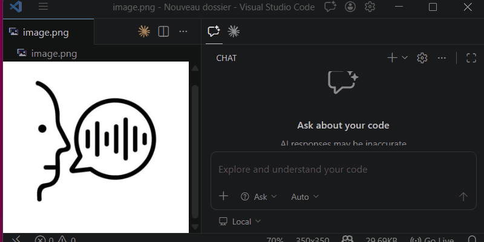
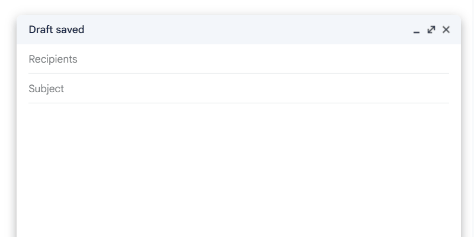
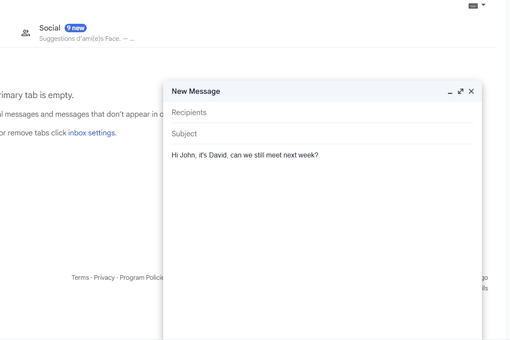
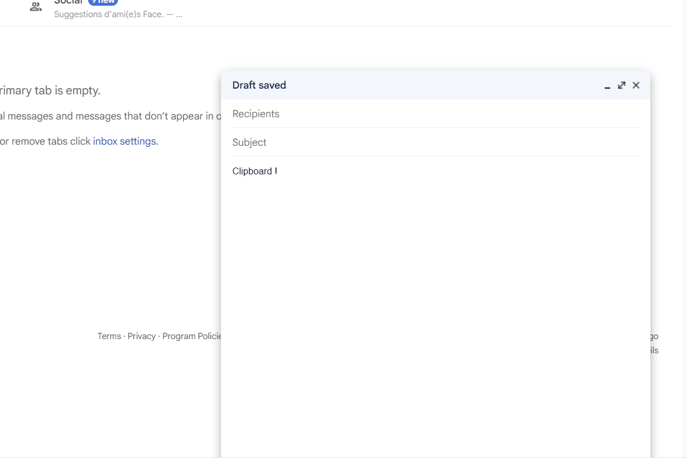

<h1 align="center">Dikto</h1>

<p align="center">
  <strong>Push-to-talk voice typing with ~50ms local STT, built-in AI translation & rewriting, system-wide overlay.</strong><br>
  <em>Like having Wispr Flow + DeepL + a clipboard manager in a single open-source app.</em>
</p>

<p align="center">
  <a href="https://github.com/david-digitis/dikto/releases"></a>
  <a href="https://github.com/david-digitis/dikto/blob/main/LICENSE"></a>
  
  
  <a href="https://github.com/david-digitis/dikto/stargazers"></a>
</p>

<!-- Demo video — uncomment when YouTube link is ready
<p align="center">
  <a href="https://youtu.be/YOUR_VIDEO_ID">
    
  </a>
</p>
-->

<p align="center">
  
  <br>
  <em>Hold Ctrl+Space, speak, release. Text appears at your cursor in any app.</em>
</p>

---

## The problem

You dictate with one tool. Translate with another. Manage your clipboard with a third. None of them talk to each other. Most are macOS-only. Nothing works on Linux/Wayland.

**Dikto replaces all three.** One tray app, one shortcut, zero cloud dependency for dictation.

---

## See it in action

### Dictate an email in 5 seconds

Hold `Ctrl+Space`, speak naturally, click **Mail EN** before releasing. Dikto transcribes your voice locally, sends only the text to Gemini, and pastes a polished professional email at your cursor.

<p align="center">
  
</p>

### Translate or rewrite any text — without leaving your app

Select text anywhere, double-tap `Ctrl+C`. An overlay appears with action buttons: translate, correct grammar, rewrite as email. Click, get the result, paste back. No window switching.

<p align="center">
  
</p>

### Clipboard history with instant paste

`Ctrl+B` opens a searchable history of everything you've copied — text and images. Arrow keys to navigate, Enter to paste. It just works.

<p align="center">
  
</p>

---

## Features at a glance

| | What it does |
|---|---|
| **Push-to-talk** | Hold `Ctrl+Space`, speak, release. Text at cursor. Any app. ~50ms. |
| **100% offline STT** | Dual engine: Parakeet TDT v3 (speed) + Whisper Turbo (accuracy). Your audio never leaves your machine. |
| **Smart translate** | Built-in DeepL-like translation. Auto-detects language direction. 7 languages. |
| **AI overlay** | Select text + double `Ctrl+C` = translate, correct, rewrite. System-wide. |
| **Mail mode** | Dictate freely, get a polished email with proper greeting and signature. |
| **Custom prompts** | Create your own Gemini-powered actions: summarize, formalize, code review, anything. |
| **Clipboard manager** | 100-entry history, search, images, keyboard navigation. |
| **Cross-platform** | Windows 11 + Linux Fedora/Wayland. 76 MB portable binary. |

<p align="center">
  
  <br>
  <em>The bubble appears during recording with dynamic action buttons.</em>
</p>

---

## How it compares

| | Dikto | Freeflow | Amical | Tambourine | Wispr Flow |
|---|:---:|:---:|:---:|:---:|:---:|
| 100% local STT | Yes | Yes | Yes | Yes | No |
| Built-in translation | **Yes** | No | No | No | No |
| AI overlay on any text | **Yes** | No | No | No | No |
| Clipboard manager | **Yes** | No | No | No | No |
| Custom AI prompts | **Yes** | No | Partial | Partial | No |
| Windows | Yes | No | Yes | Yes | No |
| Linux/Wayland | **Yes** | No | No | No | No |
| Open source | MIT | MIT | MIT | AGPL | No |
| Price | Free | Free | Free | Free | $8/mo |

> Dikto occupies a unique position: the only open-source tool covering **Windows + Linux + translation + AI overlay + clipboard** in a single binary.

---

## Quick start

### 1. Download

Grab the latest from the [**Releases page**](https://github.com/david-digitis/dikto/releases):

| Platform | Format | Size |
|----------|--------|------|
| Windows | `.exe` portable — just run, no install | ~76 MB |
| Windows | NSIS installer (start-at-login support) | ~83 MB |
| Linux | `.AppImage` | ~114 MB |

### 2. First launch

The onboarding wizard walks you through:
1. **Gemini API key** — free at [aistudio.google.com](https://aistudio.google.com/) (optional — dictation works without it)
2. **Microphone** selection
3. **Keyboard shortcuts** overview

### 3. Download an STT model

From the tray menu, open **STT Models** and download **Parakeet TDT v3** (464 MB).

That's it. Hold `Ctrl+Space` and talk.

---

## Privacy

| What | Where it goes |
|------|---------------|
| **Your voice** | **Nowhere.** Transcription is 100% local via sherpa-onnx. |
| **Transcribed text** | Sent to Gemini **only** when you explicitly click an AI action. Raw dictation never touches the network. |
| **API key** | Encrypted via Electron safeStorage. Never logged, never in config files. |

**No telemetry. No analytics. No account required.** Your data stays on your machine.

---

## Build from source

```bash
git clone https://github.com/david-digitis/dikto.git
cd dikto
npm install
npx electron .    # use a system terminal, NOT VS Code
```

```bash
npm run build:win    # Windows (.exe + NSIS installer)
npm run build:linux  # Linux (.AppImage)
```

<details>
<summary><strong>Linux prerequisites (Fedora / Wayland)</strong></summary>

```bash
sudo dnf install dotool fuse-libs
sudo systemctl enable --now dotool.service
sudo usermod -aG input $USER   # logout/login required
```

Install the GNOME extension [AppIndicator and KStatusNotifierItem Support](https://extensions.gnome.org/extension/615/appindicator-support/) for the tray icon.

</details>

---

## Tech stack

| Component | Technology |
|-----------|-----------|
| Framework | Electron 33 |
| Local STT | [sherpa-onnx-node](https://github.com/k2-fsa/sherpa-onnx) v1.12 — Parakeet TDT v3 + Whisper Turbo |
| AI | [Gemini 2.5 Flash Lite](https://ai.google.dev/) (optional, for translation/rewriting) |
| Hotkeys | uiohook-napi (Windows) / evdev (Linux/Wayland) |
| Auto-paste | VBScript (Windows) / dotool (Linux) |

**2 runtime dependencies.** No Python, no Docker, no local LLM server, no heavyweight frameworks.

---

## Roadmap

- [ ] macOS support
- [ ] Ollama / local LLM as alternative to Gemini
- [ ] GPU acceleration for STT (CUDA / Metal)
- [ ] More STT models (multilingual, specialized)
- [ ] Dictation history with search
- [ ] Voice commands ("correct that", "translate this")
- [ ] Auto-update mechanism

Have an idea? [Open an issue](https://github.com/david-digitis/dikto/issues) — feature requests are welcome.

---

## Contributing

This is my first open-source project and I'd love your help. Whether it's a bug fix, a new feature, better docs, or a translation — all contributions are welcome.

1. Fork the repo
2. Create a feature branch
3. Test on your platform
4. Open a PR — let's talk about it

**The rules are simple**: plain JavaScript, no frameworks in the renderer, no heavy deps. The app has 2 runtime dependencies — let's keep it that way. Privacy first — audio never leaves the machine.

Check out the [open issues](https://github.com/david-digitis/dikto/issues) for ideas on where to start.

---

## Credits

- **[sherpa-onnx](https://github.com/k2-fsa/sherpa-onnx)** by k2-fsa — the blazing-fast local STT engine that makes offline dictation possible
- **[NVIDIA Parakeet TDT](https://huggingface.co/nvidia/parakeet-tdt-0.6b-v2)** — the ~50ms model that makes push-to-talk feel instant
- **[OpenAI Whisper](https://github.com/openai/whisper)** — accuracy benchmark for longer dictations
- **[Google Gemini](https://ai.google.dev/)** — AI processing for translation, correction, and custom actions
- **[Electron](https://www.electronjs.org/)** — cross-platform desktop framework
- **[uiohook-napi](https://github.com/SergioRt1/uiohook-napi)** — native system-wide hotkeys

---

## License

[MIT](LICENSE) — use it, fork it, build on it.

Built by David at [Digitis](https://digitis.cloud).

---

<p align="center">
  <strong>If Dikto saves you time, a :star: on GitHub helps others discover it.</strong>
</p>
